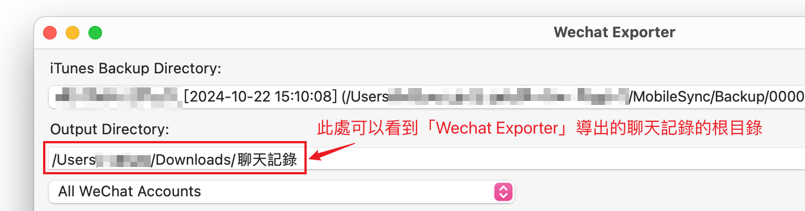
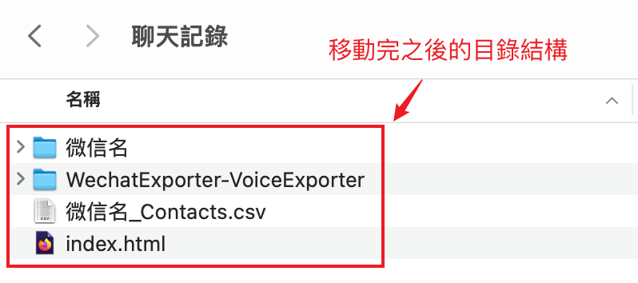

# VoiceExporter

這是一個 [WechatExporter](https://github.com/BlueMatthew/WechatExporter) 的拓展工具，旨在幫助用戶從指定的私聊或群聊中提取某人發送的所有語音訊息，並將其整理到單獨的資料夾中，方便管理和查找。


# 環境要求

1. Node.js 版本在 18.17.0 及以上。


# 使用說明

1. [點擊這裡下載壓縮包](https://github.com/BlueMatthew/WechatExporter/archive/refs/heads/main.zip)

2. 將壓縮包中的 `WechatExporter-VoiceExporter` 文件夾解壓到 WechatExporter 導出的聊天記錄的根目錄中。

    

     

    

     

    

3. 執行啟動命令

   ```
   $ cd ./WechatExporter-VoiceExporter
   $ npm install
   $ npm run start
   ```

   > 注：npm install 只有在第一次執行程序時需要輸入

4. 根據提示進行導出操作

